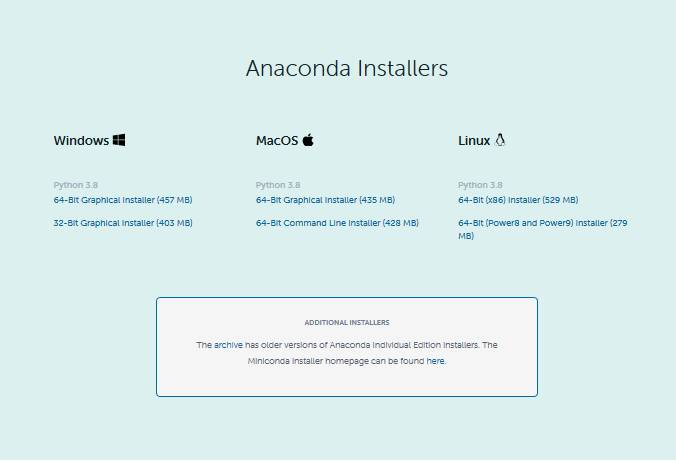

# 第一章：python数据处理入门

## 第一节：python环境安装

### 1.1python概述

**数据处理（data processing）是对计算机中各类数据的采集、存储、检索、加工、变换和传输的过程。**包括对各种原始数据的分析、整理、计算、编辑等的加工和处理。数据处理的基本目的是从大量的、杂乱无章的、难以理解的数据中抽取并推导出对于人们来说是有价值、有意义的数据。

随着大数据技术的迅速发展，很多企业由于使用了数据分析等到了更好的发展，而对于数据分析这个工作中，Python是数据科学家十分喜爱的编程语言。

**python进行数据分析的优势** 

Python在数据分析和交互、探索性计算以及数据可视化等方面都显得比较活跃，这就是Python作为数据分析的原因之一，**python中内置了很多由C语言编写的库，为数据分析提供了完整的工具集。**python拥有numpy、matplotlib、scikit-learn、pandas、ipython等工具在科学计算方面十分有优势，尤其是pandas，在处理中型数据方面可以说有着无与伦比的优势，已经成为数据分析中流砥柱的分析工具。

得益于python丰富的第三方库，比起MATLAB，R语言等其他主要用于数据分析语言，**python的语言功能更加健全，能处理的问题非常广，**从Excel比较擅长的公式计算，数据透视分析，到MATLAB比较擅长的 科学计算，再到R语言中那些零散的机器学习库，Python都能优雅从容的面对。而这些工具不擅长的网络爬虫、大数据分析，python却能够出色的完成。python有很完备的数据科学生态环境，包括Web开发、数据分析、机器学习、统计分析、科学计算等组件，十分完善。

**python作为胶水语言，可以更方便的对接其它语言，**比如C、java等。python在科学计算方面的成功部分是因为他很容易整合C、C++和FORTRAN等语言的代码。大部分现代计算环境都拥有相似的存量程序集，这些程序集使用FORTRAN和C的库进行线性代数、调试、积分等算法运算。很多公司和国家实验室都使用Python将过去数十年产生的存量软件黏合在一起。

python作为解释型语言，也具有运行速度慢的通病。但是很多程序中包含了一小部分运行起来要花费大量时间的代码，而大量“胶水代码很少运行。很多情况下，胶水代码的执行可以忽略不计；精力应该当更多地投入优化计算瓶颈的方面，有些时候需要将代码迁移到底层语言，比如C。

### 1.2Anaconda+VSCode搭建python环境


**anaconda简介**

python具有数量庞大且功能相对完善的标准库和第三方库，因此管理这些库以及对库作及时的维护成为既重要但复杂度又高的事情。

Anaconda 是专门为了方便使用 Python 进行数据科学研究而建立的一组软件包，涵盖了数据科学领域常见的 Python 库，并且自带了专门用来解决软件环境依赖问题的 conda 包管理系统。主要是提供了**包管理与环境管理的功能**，可以很方便地解决多版本python并存、切换以及各种第三方包安装问题。Anaconda利用工具、命令conda来进行package和environment的管理，并且已经包含了Python和相关的配套工具。可以高性能使用使用python和R语言支持，且有开源，免费的社区支持。

 conda可以理解为一个工具，也是一个可执行命令，其核心功能是**包管理**与**环境管理**。conda与pip相比有如下优点：

- conda是跨平台且不限语言的，可以独自创建虚拟环境。
- 在安装包的时候列出所需其他依赖包，安装包时自动安装其依赖项。
- 可以便捷地在包的不同版本中自由切换
- 比较方便地在不同环境之间进行切换，环境管理较为简单，结合了pip和virtualenv的关系，不会影响系统自带python。

 Anaconda则是一个打包的集合，里面预装好了conda、某个版本的python、众多packages、科学计算工具等等，所以也称为Python的一种发行版。其实还有Miniconda，它只包含最基本的内容——python与conda，以及相关的必须依赖项，对于空间要求严格的用户，Miniconda是一种选择。

**几种python集成开发环境的优缺点**

| 名称    | 优点                                                         | 缺点                                                         |
| ------- | :----------------------------------------------------------- | :----------------------------------------------------------- |
| jupyter | 1.在数据处理方面，其逻辑比较简单，代码量也不大，而最难在于数据的显示，而jupyter可以合理高效的展示数据。它可以便捷的执行各种端到端的任务，如数据清洗，统计建模，构建和训练机器学习模型。2.jupyter的单元结构设计对python初学者十分友好，他的一个特色是允许把代码写入独立cell中，然后单独执行，并在测试项目时单独测试特定代码块，无需从头开始执行。3.jupyter具有灵活性和交互性，支持40余种编程语言，它可以把实时运行的代码，叙述性文本和可视化被整合在一起。方便使用代码和数据讲述故事。 | 安装和配置路径复杂                                           |
| IDLE    | 1.体积小，启动速度相对较快，使用便捷。2.零学习成本，对照教程容易上手，适用于基础学习。 | 1.自带的数据包较少，需要自己安装很多包，且安装包之间有依赖性。2.没有代码提示功能。3.界面不友好。 |
| pycham  | 1.方便的环境管理，运行代码时pycham可以为当前项目指定环境。2.自动导入包。pycham可以通过Alt+Enter自动导入包。 | 1.索引包较慢，内存占用太高。2.对于初学者来说，PyCharm的界面庞杂，其优点的成本较为高昂。 |
| VScode  | 1.轻量，启动很快，占内存小。2.界面好看、开源免费             | 1.轻量级的背后，有许多插件的支持，故需要安装较多插件。2.没有像pycham的自动导包功能 |
| spyder  | 1.可以方便地观察数据的值。2.anaconda下载之后Spyder随之安装，不需要单独下载。 | 相对于其他编译器而言，Spyder的运行不太稳定。                 |

**Anaconda+VSCode搭建python环境**

**1、文件下载**

最新的Anaconda3-5.1.0-Windows-x_64.exe版本中在安装的时候已经打包好了vscode，就是在anaconda3安装完成之后，会提示你是否要安装vscode，然后勾选就可以完成vscode的安装。

anaconda的最新版可以去官网下载（https://www.anaconda.com/distribution/），官网提供了不同版本的安装包，根据自己的需要选择下载。

           


 **2、Anaconda3安装流程**


​                                                                                                                开始安装


​                                                                                                        同意anaconda条款


​                                                                                            选择安装的路径，点击Next


Add Anaconda 3 to PATH enviorment varible ：是需要将Anaconda配置到PATH环境变量里，需要勾选;

Anaconda 3  as my default Python :把Anaconda的Python设置为系统默认的Python模块，需勾选。


​                                                                                                          安装结束

**3.VS code设置**


​                                                                                          安装并打开VS code


​                                                           安装chinese扩展包设置中文语言环境，并安装python扩展包

**4，新建python文件**


​                                                                                                         新建文件


​                                                                                                       保存文件


​                                                                              选择路径和文件类型，文件类型为python


​                                                                                                        开始编写代码

## 第二节：重要的python库

###  2.1Numpy

Numpy（Numerical Python），是Python科学计算的基础包，可作为在算法之间传递数据的容器，非常适合进行数据分析。Numpy的数据结构是n维的数组对象，叫做ndarray，支持大量的数据运算以及数学算法，集成C/C++和Fortran代码的工具。虽然python的list也能表示。但是不高效，随着列表数据的增加，效率会降低。Numpy还包括其他内容：

- 快速、高效的多维数组对象ndarray
- 基于元素的数组计算或数组间数学操作函数
- 用于读写硬盘中基于数组的数据集的工具
- 线性代数操作、傅里叶变换以及随机数生成

### 2.2Pandas

pandas是一个强大的python数据分析的工具包。其主要数据结构是Series（一维数据）与DataFrame（二维数据）。这两种数据结构足以处理金融、统计、社会科学、工程等领域里的大部分典型的用例。pandas基于Numpy来构建，提供了使我们能够快速便捷地处理结构化数据的大量数据结构和函数，是使Python成为强大而高效的数据分析环境的重要因素之一。其主要功能有：

- 具有强大的工具集，例如DataFrame和Series
- 强大、灵活的分组（group by）功能，可以用来拆分-应用-组合数据集，聚合、转换数据
- 提供丰富的数学运算和操作
- 灵活处理缺失数据
- 集成时间序列等功能

**利用pandas读取Excel文件**

Excel是微软的经典之作，在日常工作中的数据整理、分析和可视化方面，有其独到的优势，尤其在你熟练应用了函数和数据透视等高级功能之后，Excel可以大幅度提高你的工作效率。但如果数据量超大，Excel的劣势也就随之而来，甚至因为内存溢出无法打开文件，后续的分析更是难上加难。而python的pandas数据分析包可以来解决此问题。

使用`pandas.read_excel`来读取储存在Excel中的数据

```python
import pandas as pd
io = r'data.xlsx'
#io，Excel的存储路径,建议使用英文路径以及英文命名方式。
data = pd.read_excel(io，index_col=0)
```

使用`pandas.to_excel`将数据写入Excel

```python
data.to_excel('data2.xlsx')
```

**实例：求Excel数据中的平均分、方差、标准差**

Excal中苹果价格数据：

| 时间     | 苹果 | 红富士苹果 | 王琳苹果 | 国光苹果 |
| -------- | ---- | ---------- | -------- | -------- |
| 20191130 | 1.8  | 1.85       | 1.18     | 2        |
| 20191205 | 3.04 | 2.85       | 2.86     | 1.36     |
| 20191210 | 2.27 | 1.85       | 1.37     | 1.32     |
| 20191215 | 2.03 | 1.77       | 2.18     | 1.41     |
| 20191220 | 2.17 | 2.05       | 1.52     | 1.38     |
| 20191225 | 2.1  | 1.97       | 1.76     | 1.42     |
| 20191230 | 5.42 | 2.11       | 2.63     | 1.28     |
| 20200104 | 4.87 | 1.89       | 2.15     | 1.29     |
| 20200109 | 4.92 | 1.87       | 2.03     | 1.3      |
| 20200114 | 5.28 | 1.91       | 2.5      | 1.27     |
| 20200119 | 5.18 | 1.96       | 2.01     | 1.3      |
| 20200124 | 5.56 | 1.69       | 1.98     | 1.38     |
| 20200129 | 6.17 | 1.72       | 2.19     | 1.01     |

```python
#求不同品种的苹果价格的平均值
for i in range(1,4):
    mean=data.iloc[:, i].mean()
#求每一列的方差
data.var()
#求每一行的标准差
print(data.std())
```

### 2.3Matplotlib

matplotlib是最流行的用于绘制数据图表的Python库，matplotlib是基于numpy的一套Python工具包。这个包提供了丰富的数据绘图工具，主要用于绘制一些统计图形。

而Seaborn是基于matplotlib的图形可视化python包。它提供了一种高度交互式界面，便于用户能够做出各种有吸引力的统计图表。


**示例：绘制苹果价格折线图**

使用`plot`绘制折线图

```python 
data2=pd.DataFrame(data.values,
                  columns=data.columns,
                  index=np.arange(0,130,10))
s.plot()
```


**2.柱状图**

```python
s = pd.series(data)
s.plot.barh(color='k',alpha=0.7)
#选项color='k'设置柱状图颜色，alpha=0.7将图像填充色设置为部分透明
```

**3.散点图**

使用seaborn的`regplot`方法绘制散点图

```python
import seaborn as sns
sns.regplot()
```

**4.饼状图**

```python
matplotlib.pyplot.pie() 
```

```python
sns.distplot
```


